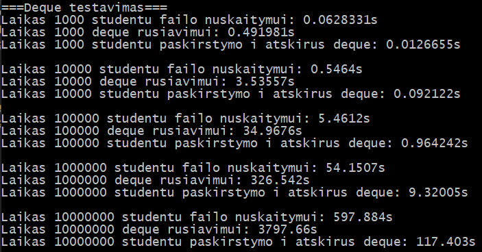
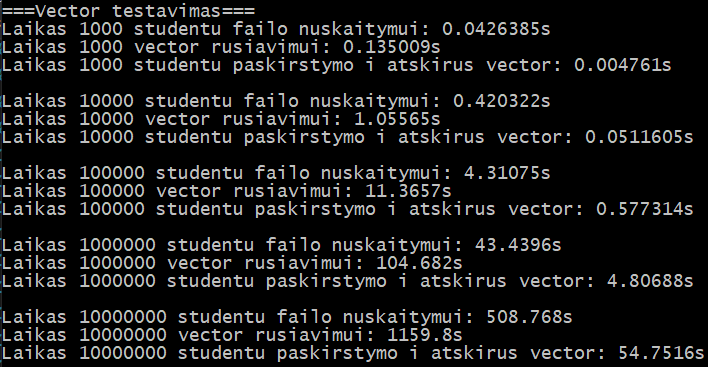
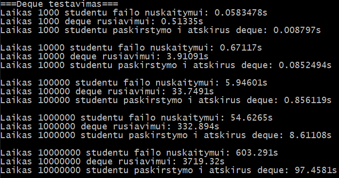
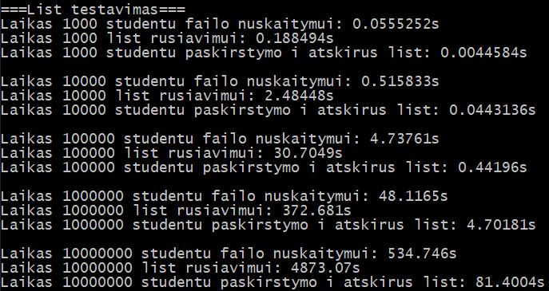
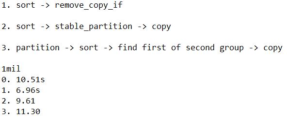
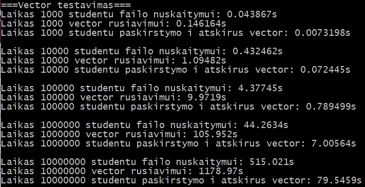

# About
This piece of software was created as a university task assignment and written in C++ using Visual Studio 2019.
Its purpose is read/write student data (name, surname, grades, exam grade) from/to a data file and to compute the final scores using a predefined formula: 
> final = 0.4 * average_grade + 0.6 * exam

# Installation
1. **Visual Studio**
<br/>Open the included .sln file using Visual Studio, build&run.
2. **Makefile**
<br/>Navigate to the directory using a unix terminal and run the 'make' command. Launch the program by typing './main'.

# Releases
## PC used for testing:
- Intel® Core™ i7-8750H
- 16GB of DDR4 2666 Mhz RAM
- Samsung PM981 Polaris 512GB M.2

## [v0.1](https://github.com/VKG147/vu-isi-student-results/releases/tag/v0.1)
Initial release of vu-isi-student-results. Basic functionality with ```std::vector``` container.

## [v0.1.1](https://github.com/VKG147/vu-isi-student-results/releases/tag/v0.1.1)
Added C array implementation.

## [v0.2](https://github.com/VKG147/vu-isi-student-results/releases/tag/v0.2)
Support for reading from file.

## [v0.2.1](https://github.com/VKG147/vu-isi-student-results/releases/tag/v0.2.1)
Input file reading with optional data header.

## [v0.3](https://github.com/VKG147/vu-isi-student-results/releases/tag/v0.3)
Code split into header and source files. Added exception handling.

## [v0.4](https://github.com/VKG147/vu-isi-student-results/releases/tag/v0.4)
The initial design used ```std::vector``` for storing student data. Multiple tests of 10^3, 10^4, 10^5, 10^6 and 10^7 randomly generated student data were run to showcase the perfomance of the program.


## [v0.5](https://github.com/VKG147/vu-isi-student-results/releases/tag/v0.5)
Three seperate instances of the projects were created. Other data types (```std::list``` and ```std::deque```) were also tested.
The decision to omit data generation and writing to file as metrics for the tests was also made as these should not be affected by the type of container used.<br/>
<br/>```std::vector```:
<br/>

<br/>```std::deque```:
<br/>

<br/>```std::list```:
<br/>

## [v0.5.1](https://github.com/VKG147/vu-isi-student-results/releases/tag/v0.5.1)
All data containers cleared whenever their data becomes obsolete. Space is now reserved for ```std::vector``` before each test.

## [v1.0](https://github.com/VKG147/vu-isi-student-results/releases/tag/v1.0)
Added second data splitting strategy for each container. Instead of two new containers, only one is used while procedurely erasing elements from the initial container.<br/>
<br/>```std::vector```:
<br/>

<br/>```std::deque```:
<br/>

<br/>```std::list```:
<br/>

Additionaly, added an optimised version of ```std::vector```. Different strategies for optimisation were considered. Ultimately,  ```std::remove_copy_if()``` was chosen. Ran a few tests to determine the best one:<br/>
<br/>

<br/>Tests with optimised ```std::vector``` implementation:
<br/>

## Test insights
### Data reading
1. ```std::list```
2. ```std::vector```
3. ```std::deque```
> Overall ```std::list``` performed the best and ```std::deque``` the worst, while ```std::vector``` stands right in the middle.
### Data sorting
1. ```std::vector```
2. ```std::deque```
3. ```std::list```
> ```std::vector``` completely outperformed the other two containers by a huge margin. ```std::list``` takes the shameful last place.
### Data separation (into two containers)
#### Strategy No. 1
1. ```std::list```
2. ```std::deque```
3. ```std::vector```
> This operation didn't take that much time compared to sorting, but ```std::list``` was slightly better than the other two containers.
#### Strategy No. 2
1. ```std::list```
2. ```std::deque```
3. ```std::vector```
> ```std::list``` and ```std::deque``` received a noticable perfomance, while ```std::vector``` got so slow that it was not worth running the tests for longer.
#### Optimised ```std::vector```
> ```std::vector``` performed about 36% better than its unoptimised version, quite a noticeable improvement.

### Conclusion
```std::vector``` is by far the best container for data sorting, while ```std::list``` takes the medal for less complex operations (reading and separation). 
```std::deque``` seems like a sort of middle ground, however it is still strongly outperformed by ```std::vector``` in terms of sorting.
